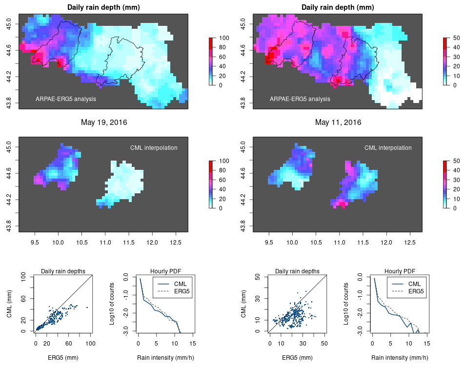

RAINLINK: Retrieval algorithm for rainfall mapping from microwave links in a cellular communication network.
------

Forked from overeem11/RAINLINK v1.14
Small adaptations to the Emilia Romagna Region (Italy) and some new handy functions and plotting methods.

